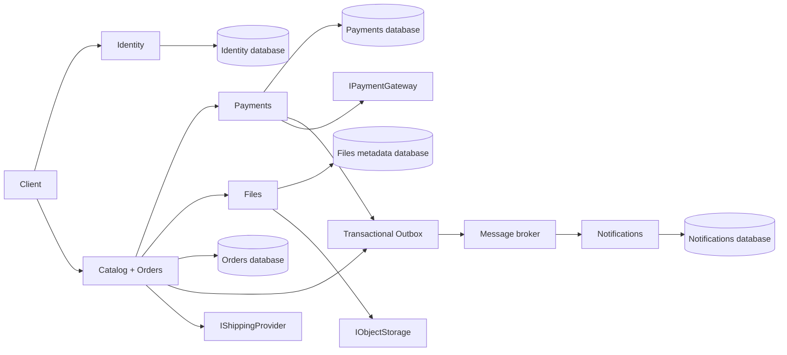
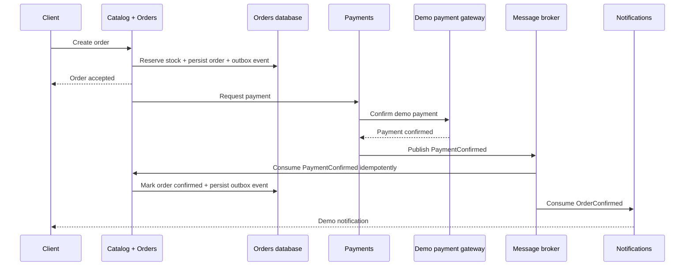
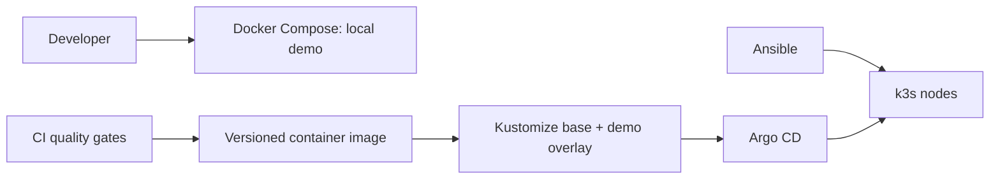

# Architecture overview

## Purpose

Fulfillment Platform Backend is a portfolio implementation of a commerce fulfilment backend. It focuses on the engineering concerns behind a reliable order lifecycle: domain boundaries, provider isolation, event delivery, testing and deployability.

The repository is a standalone demo environment. It does not represent or expose any production topology, credentials or external provider configuration.

## Component model

The solid service boundaries keep domain rules close to their owning module. Inter-service interaction happens through explicit contracts and events, rather than direct database access.

## Order confirmation flow

## Reliability controls

| Concern | Design response |
| --- | --- |
| Database write and event publication | Transactional Outbox avoids losing an event after a successful state transition |
| Repeated requests or deliveries | Idempotency keys and consumer-side deduplication make retries safe |
| External providers | Interfaces isolate payment, shipping, notification and storage adapters from domain logic |
| Critical flows | Integration tests exercise the same public flow as the local demo |
| Operations | Health checks, structured logs, metrics and traces are designed as cross-cutting concerns |

## Delivery model

Ansible is responsible for bootstrapping generic k3s nodes. Application manifests are managed declaratively after bootstrap. VM lifecycle automation is deliberately outside the initial scope; see the relevant ADR.

## Intentional limits of the portfolio version

- Demo adapters replace real external providers.
- Local Docker Compose is the supported first-run path.
- Kubernetes and Ansible assets are generic examples, not deployment instructions for a live system.
- Autoscaling and multi-host availability are future evolution topics, not claims made by this repository.
