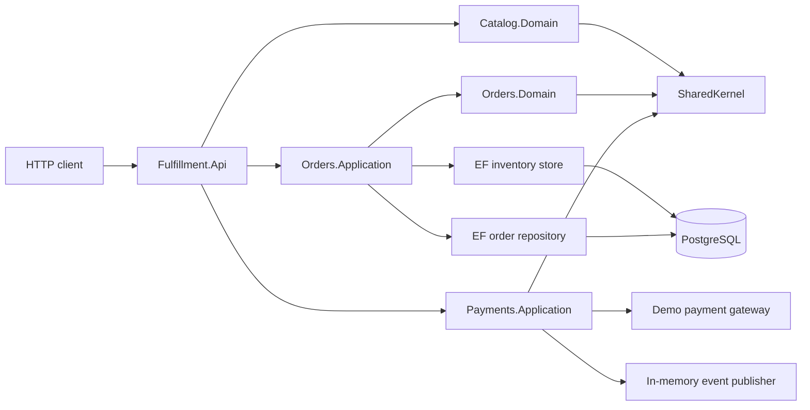
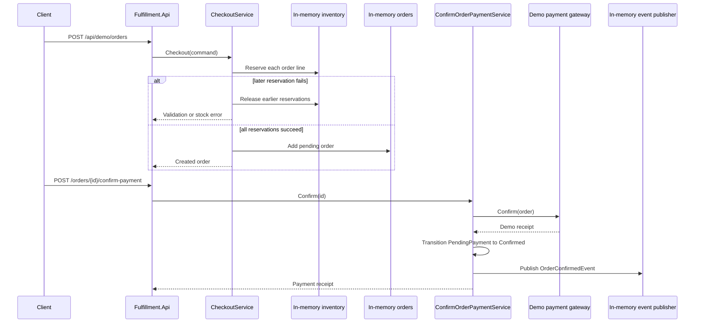

# Architecture overview

## Purpose

Fulfillment Platform Backend is a runnable portfolio case study for a single order-fulfilment workflow. It demonstrates domain boundaries, error handling, checkout compensation, provider abstraction, testing, and safe local delivery.

The repository is standalone. It contains no production topology, credentials, provider configuration, or real external integrations.

## Implemented now

### Component model

`Fulfillment.Api` composes the modules. Domain projects do not depend on ASP.NET Core, Docker, Kubernetes, or a persistence library.

### Checkout and payment flow

Orders, order lines, inventory, and reservations are persisted in PostgreSQL through EF Core migrations. The demo payment gateway and event publisher remain process-memory adapters, so restarting the API resets only published events.

### Reliability controls that exist today

| Concern | Current implementation | Evidence |
| --- | --- | --- |
| Input and domain validation | `Result`/`Error` values map to problem details | [API integration tests](../../tests/Api/Fulfillment.Api.IntegrationTests/DemoCheckoutFlowTests.cs) |
| Partial checkout failure | Earlier reservations are released when a later reservation fails | [checkout tests](../../tests/Orders/Orders.Application.Tests/CheckoutServiceTests.cs) |
| Durable state | Orders and inventory are mapped through EF Core migrations to PostgreSQL | [PostgreSQL integration tests](../../tests/Api/Fulfillment.Api.IntegrationTests/DemoCheckoutFlowTests.cs) |
| Repeated payment confirmation | A non-pending order is rejected before the payment gateway is called | [payment tests](../../tests/Payments/Payments.Application.Tests/ConfirmOrderPaymentServiceTests.cs) |
| Runtime health | `GET /health` is exposed by the API and container | [Program.cs](../../src/Api/Fulfillment.Api/Program.cs) |
| Local runtime safety | Non-root container, health check, and no secrets in Compose | [Dockerfile](../../infra/docker/Dockerfile) |

## Planned evolution

The following items are design targets, not implemented capabilities. They are deferred until the preceding persistence and correctness work is complete.

| Capability | Why it is needed | Roadmap stage |
| --- | --- | --- |
| Concurrency-safe reservations | Prevent overselling under parallel checkout | [Stage 3](../SENIOR_PORTFOLIO_ROADMAP.md#stage-3--guarantee-inventory-correctness-under-concurrency) |
| Transactional Outbox | Atomically record state changes and outgoing events | [Stage 4](../SENIOR_PORTFOLIO_ROADMAP.md#stage-4--implement-transactional-outbox) |
| HTTP and consumer idempotency | Safely handle retries and repeated delivery | [Stage 5](../SENIOR_PORTFOLIO_ROADMAP.md#stage-5--add-request-and-consumer-idempotency) |
| OpenTelemetry and dependency readiness | Diagnose failures and expose operational state | [Stage 6](../SENIOR_PORTFOLIO_ROADMAP.md#stage-6--add-operational-visibility) |
| Kubernetes/Ansible hardening | Verify generic delivery examples more deeply | [Stage 7](../SENIOR_PORTFOLIO_ROADMAP.md#stage-7--harden-delivery-evidence) |

## Deliberate non-goals for the portfolio version

- Authentication and user identity.
- Shipping, notifications, file storage, and real payment-provider adapters.
- A message broker or multi-service deployment.
- A live Kubernetes cluster, GitOps controller, or VM lifecycle automation.
- Autoscaling: an HPA should be added only after a measured workload supplies a justified metric.

## Delivery examples

Docker Compose is the supported first-run path. Kubernetes and Ansible files are generic examples for review and static validation only; they are not instructions for deploying this project to a live environment.
